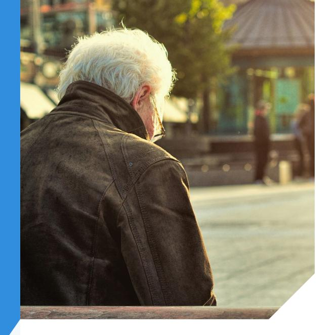
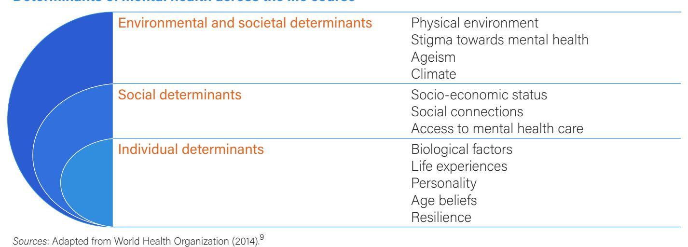
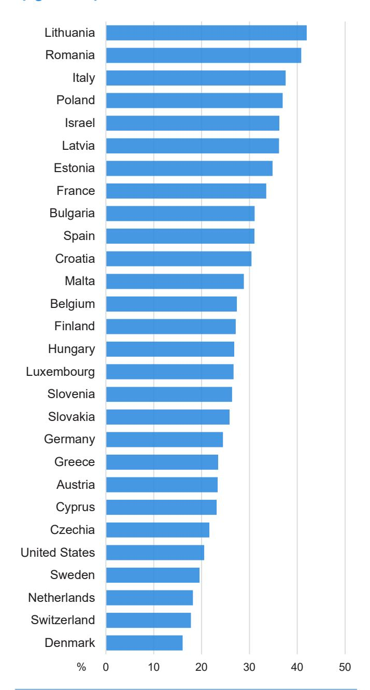
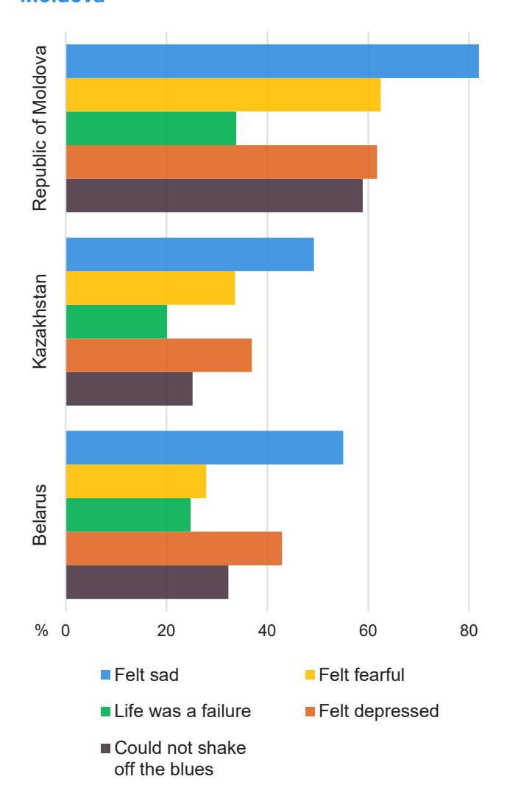
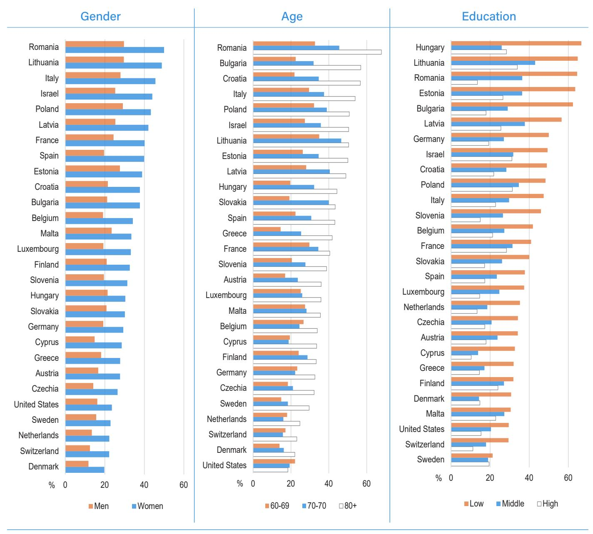
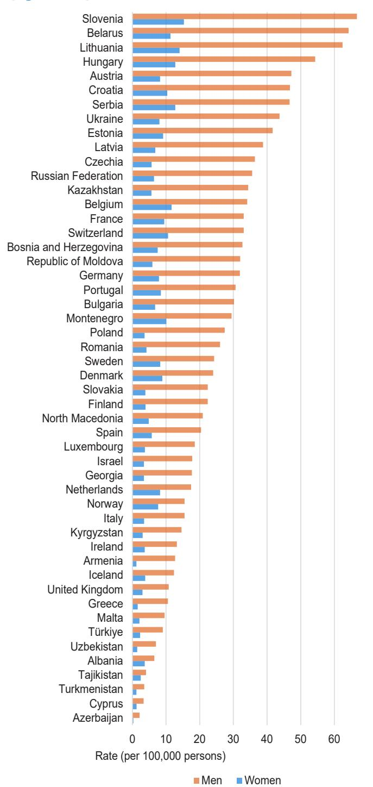

# Policy Brief on Ageing

# Mental Health of Older Persons

#### Contents

| Mental health of older persons:  |    |
|----------------------------------|----|
| a human right and priority for   |    |
| sustainable development          | 2  |
| Determinants of mental health    |    |
| in later life                    | 2  |
| Prevalence of mental health      |    |
| conditions among older persons   |    |
| in the UNECE region              | 5  |
| Policy strategies to improve the |    |
| mental health of older persons   | 9  |
| Conclusions                      | 18 |
| Checklist                        | 20 |
| References                       | 22 |

# Suggested strategies

- Address specific needs of older persons in mental health policies
- Eliminate stigma and improve mental health literacy
- Combat ageism
- Invest in prevention and early detection
- Tackle psychosocial challenges in work and care
- Support older persons during challenging life events
- Integrate mental health services into primary and long-term care
- Improve access to treatment for mental health care
- Protect mental health of older persons in emergencies
- Enhance research and data collection on mental health of older persons

# Policy challenge

The mental health of older persons often goes unnoticed. Yet, a significant portion struggle with mental disorders, particularly depression. Depression alone affects up to 30 per cent of older Europeans and 14 per cent of older persons in North America, with a concerning increase in prevalence in recent years[.1,2](#page-21-0),[3](#page-21-0) Loneliness, a major risk factor, impacts nearly 30 per cent of older persons in some countries[,4](#page-21-0) further exacerbated by the COVID-19 pandemic. Effectively promoting, protecting, and caring for the mental health of older persons requires addressing several challenges. This involves closing the significant treatment gap – 80 per cent of cases of depression among older persons in Europe are untreated[.1](#page-21-1) It also requires mitigating the negative impacts of poor mental health on older persons and their families, while protecting vulnerable groups like those in long-term care facilities. Due to the multiple and intersecting factors putting older persons from disadvantaged backgrounds at greater risk of mental disorders, addressing the wider social disparities in mental health is equally important.

# What this brief is about

This policy brief presents determinants and risk factors of poor mental health among older persons and provides a detailed overview of the prevalence of mental health disorders among older persons of different socio-demographic characteristics across the region. The policy brief highlights different policy strategies to promote, protect and care for the mental health of older persons, with examples contributed by Governments and civil society organizations across the United Nations Economic Commission for Europe (UNECE) region. The policy brief also offers a checklist of effective measures to promote and protect the mental health of older persons covered in this brief.

# Mental health of older persons: a human right and priority for sustainable development

Mental health is a cornerstone of individual and societal well-being and is recognized as a basic human right in the Universal Declaration of Human Rights. All older persons have the right to be protected from factors that harm their mental well-being and, in case of need, to have access to high-quality and culturally appropriate mental health-care services.

Mental health transcends the mere absence of diagnosable disorders and encompasses an interplay of various dimensions. It is essential to view mental health as a continuum that recognizes the full spectrum of individual experiences. According to the World Health Organization (WHO), mental health is a state of well-being in which individuals realize their own abilities, can cope with the normal stresses of life, can work productively and fruitfully, and are able to make a contribution to their community[.5](#page-21-0) Older persons' own definition of what constitutes good mental health may differ according to cultural norms and societal values. It may also differ to that of younger persons as priorities, goals and expectations change throughout life. Older persons may prioritize mental health aspects that relate to their physical health and functioning, such as managing chronic illnesses, maintaining mobility and cognitive function, and coping with pain or disability. They may also place greater importance on social relationships and support networks as they age.

The term mental health condition encompasses a variety of issues, from diagnosed disorders to emotional distress that impacts daily functioning or increases the risk of self-harm, for instance, feeling overwhelmed, helpless, or hopeless. Mental disorders are more narrowly defined and refer to clinically diagnosed disorders characterized by specific symptoms and functional impairments. Examples include depression, anxiety, and post-traumatic stress disorder.

The 2030 Agenda for Sustainable Development promotes mental health and well-being as part of its broader goal to promote well-being for all at all ages (Sustainable Development Goal 3, Target 3.4). At the same time, mental health is directly related to all 17 Sustainable Development Goals (SDGs), often in a bi-directional way[.6](#page-21-0) For example, poor mental health may push an older person out of the labour market (SDG 8 – Decent work and economic growth) and into poverty (SDG 1 – No poverty), which – in turn – may aggravate existing mental health conditions.

# Determinants of mental health in later life

Mental health is a complex phenomenon that is shaped by a multitude of determinants that interact throughout life. Over the course of their lives individuals accumulate experiences and exposures that create unique vulnerabilities and strengths. Understanding these determinants across different domains is important for designing effective policies that support mental health in later life.

#### Individual determinants

Each person has a constellation of factors influencing their susceptibility to mental health challenges. Genetic predisposition can play a role in various mental disorders.[7](#page-21-0) An individual's personality traits and life experiences interact with genetic factors across the life course. Major life events such as retirement, bereavement, relocation, becoming a caregiver, or transitioning to an assisted living facility can be very difficult experiences and may trigger mental disorders in older persons. In later life, individuals may be more

#### Table 1 Definitions

#### Mental health

A state of well-being in which individuals realize their own abilities, can cope with the normal stresses of life, can work productively and fruitfully, and are able to make a contribution to their community.[5](#page-21-2)

#### Mental health condition

Refers to a wide range of issues, including mental disorders, psychological disabilities, and anything causing significant emotional distress, difficulty functioning, or potential self-harm.

#### Mental disorder

As per International Classification of Diseases 11th Revision (ICD-11), mental disorders are clinically relevant symptoms that significantly disrupt an individual's cognition, management of emotions, or behaviours. Examples are anxiety disorders, depression and schizophrenia.

Sources: World Health Organization (2004 and 2022).

likely to face challenges related to declining physical health, chronic illnesses, and disability. Older persons are more likely to experience the cognitive or physical decline or death of friends and family members, leading to feelings of loneliness and depression. Oftentimes, multiple challenges present themselves at the same time. These circumstances can contribute to older persons being at particular risk of mental disorders. For example, mobility limitations or providing care to parents or spouses may reduce older persons' ability to engage in activities they enjoy, leading to a decline in social interactions, mood and eventually to depression. Being exposed to violence, abuse and neglect amplify the risk of mental disorders in later life and exposure to stressors can also increase the risk of substance abuse, such as excessive alcohol consumption, which is an important risk factor for mental disorder. At the same time, older persons maintaining positive attitudes towards ageing are more likely to cope with declining physical health and preserve good mental health. Lifestyle factors such as reduced or no alcohol consumption, not smoking, engaging in regular physical and social activity and more frequent fresh vegetable and fruit consumption are positively associated with mental health. The experiences of challenging situations can also increase resilience and coping capacity for some individuals.

Resilience is a very important factor in safeguarding mental health of older persons. It allows individuals to bounce back from shocks like loss, illness, or disability. Resilient older persons can find meaning and purpose, maintain a positive outlook, and cope effectively with stress. This mental strength can help them adapt to life changes and navigate the inevitable challenges of ageing, promoting a sense of wellbeing and overall better mental health. Remaining resilient in older age can be particularly challenging. The intersecting individual, social, and environmental factors that increase risk of mental disorders in older age can also impair resilience even among older persons who experienced good mental health earlier in the life course. Nonetheless, resilience can be nurtured and promoted by supportive networks and environments. By fostering social connections, engaging in activities that generate a sense of selfworth and purpose, and maintaining a healthy lifestyle, older persons can build the resources needed to cope with challenging life events and live a fulfilling life.[8](#page-21-0)

#### Social determinants

Socio-economic status, gender roles, and social relations shape opportunities, resources, and exposure to stressors, all impacting mental health in later life.[9,10](#page-21-0)

For instance, among older persons, financial strain due to inadequate retirement savings or high costs for health care can contribute to stress and anxiety, increasing the risk of mental disorder. Conversely, evidence strongly suggests that income sufficiency in later life, for example through adequate pensions, is positively associated with better mental health. Maintaining social networks and social participation in later life, including through employment, lifelong learning, volunteering, and civic engagement in the community can help enhance sense of purpose and contribute to improved mental health.

Access to quality health care, including to mental health services, is a critical social determinant of mental health. Limited access to mental health services, for instance due to high costs, lack of health-care providers or absence of barrier-free public transport, can prevent older persons from receiving timely and appropriate diagnosis and treatment for mental disorders. Conversely, accessible and affordable health care is associated with better mental health outcomes of older persons. Mental health literacy – the ability to adequately identify symptoms of common mental disorders – is strongly related to the likelihood of a person to seek and receive treatment. Compared to younger persons, older persons tend to have lower levels of health literacy. This is especially true for those with lower socio-economic status. For example, many older persons may not (correctly) classify feelings of worry or dizziness as symptoms of anxiety disorder but rather as symptoms of normal ageing[,11](#page-21-0) thus preventing them from seeking help.

#### Environmental and societal determinants

The physical and social environment in which people live and grow old shape their physical and mental abilities throughout their lives and play a significant role in mental health. For example, living in neighbourhoods with high crime rates or fear of crime can lead to chronic anxiety, limiting social engagement and participation in community life. The latter applies to younger as well as older persons. However, older persons tend to be more worried about their own security, making them more likely to restrict their daily routines. Also, exposure to extreme weather events, such as heat waves, and climate change can have adverse mental health effects, particularly on older persons[.12](#page-21-0) Places that are age-friendly provide safe and barrier-free outdoor spaces with plenty of seating so that older persons can stay physically active. They also provide affordable and barrier-free public transportation, allowing older persons to access public services and visit friends and family. Evidence shows that living in more age-friendly environments is

Figure 1 Determinants of mental health across the life course

strongly associated with better mental health among older persons[.13,14](#page-21-0)

Widespread negative attitudes and stigma towards mental health are also important determinants of older persons' mental health. They can deter helpseeking and reduce the likelihood of being diagnosed. Although mental health-related stigma is declining in recent years it remains significantly higher among older persons than among younger persons[.15](#page-21-0) A possible explanation for this circumstance is that older persons grew up in a cultural and social context during which stigmas towards mental health were still much more widespread than today.

#### Ageism

Ageism, which continues to be widespread and cuts across the above-mentioned determinants, can significantly harm the mental well-being of older persons, lead to social isolation and loneliness, greater financial insecurity, and decreased quality of life and premature death[.16,17](#page-21-0) Exposure to stereotypes about age-related decline through the media or condescending treatment can lead older persons to experience depression, anxiety, and even suicidal thoughts. Ageism can become internalized, leading older persons to believe they are incapable and discouraging them from seeking help for mental health issues[.18](#page-21-0) Another widespread issue is that older persons are often not diagnosed accurately for mental health disorders because symptoms are overlooked due to other physical or cognitive limitations, including dementia, or are dismissed as a normal part of ageing. This is also known as diagnostic overshadowing. Ageism can also lead to social isolation[,19](#page-21-0) a major risk factor for mental health problems. Conversely, positive beliefs about ageing have been shown to enhance mental health, for instance by reducing stress levels and inflammation, prevalence of chronic pain and risk of hospitalization.[20,](#page-21-0) 21

Table 2 Risk and promoting factors for mental health among older persons

| Risk factors                                                        | Promoting factors                        |
|---------------------------------------------------------------------|------------------------------------------|
| Low education or income                                             | Economic security                        |
| Substance use                                                       | Healthy lifestyle                        |
| Abuse and violence                                                  | Sense of purpose                         |
| Loss of loved one and bereavement                                   | Social support and active social network |
| Social isolation and loneliness                                     | Access to mental health-care services    |
| Ageism                                                              | Age-friendly environments                |
| Extreme weather and climate                                         | Security                                 |
| Loss of functional ability                                          | Cognitive activity                       |
| Sources: World Health Organization (2022),22 Maier et al. (2021).23 |                                          |

# Prevalence of mental health conditions among older persons in the UNECE region

#### Prevalence of common mental health conditions

Figure 2 shows the prevalence of depression among older persons in various countries in the region. In nearly every country with data, more than one in five persons aged 60 and older were at high risk of clinical depression in 2019–2020 (Figure 2). The prevalence of depression ranges between 20 and 35 per cent in most countries, but there are some significant differences. In Lithuania and Romania, for example, around 40 per cent of older persons are affected by depression. Depressive disorders represent the largest proportion (41 per cent) of disability-adjusted life years (DALYs) attributable to mental disorders among older persons in the region. It is followed by anxiety disorders (21 per cent) and schizophrenia (8.5 per cent).[24,](#page-21-0) 25

The high prevalence of depression among older persons in many countries in the region is concerning, especially given that the large majority of affected individuals do not receive treatment[.1](#page-21-1) This puts those individuals at substantial risk of increased physical health problems and even suicide. It can also strain relationships with family members who become primary caregivers, putting them also at risk of depression or anxiety. In some cases, depression may force older persons to leave the workforce prematurely, reducing their financial independence and impacting the overall economy.

Generations and Gender Survey data collected in select Eastern European and Central Asian countries indicate the prevalence of five different feelings among older persons that are often associated with depression and anxiety disorders such as sadness, fear, sense of failure, feeling depressed and not being able to shake off the blues. A majority of persons aged 60 and older in Belarus and Republic of Moldova and nearly 50 per cent in Kazakhstan report feeling sad at least some of the time (Figure 3). After sadness, feelings of depression and fearfulness are most commonly reported among adults aged 60 and older.

Such negative feelings can significantly impact an older person's ability to enjoy daily activities, maintain relationships, and live independently. It can also lead to

#### Depression affects more than 1 in 4 older persons

Figure 2 Prevalence of depression among older persons (aged 60+) in selected UNECE countries

Notes: Includes individuals aged 60 years or older. Data for the United States of America were collected in 2020, and in 2019–2020 for the remaining countries. Persons are classified as being at high risk of clinical depression based on the Center for Epidemiological Studies-Depression (CES-D) scale in the United States and the EURO-D scale for the remaining countries. Due to differences in the underlying scales, the prevalence of depression for the United States of America is not fully comparable with the remaining countries.

Sources: Health and Retirement Study (HRS)[26](#page-21-0) and the Survey of Health, Ageing and Retirement in Europe (SHARE).[27](#page-21-0)

#### More than half of older persons feel sad at least sometimes

Figure 3 Mental health conditions among older persons in Belarus, Kazakhstan and the Republic of Moldova

Notes: The figure shows the percentage of older persons (aged 60 or above) who report the respective feeling at least sometimes, often or most or all of the time, versus seldom or never. Data were collected in 2018 for Kazakhstan, in 2017 for Belarus and in 2020 in the Republic of Moldova.

Sources: Generations and Gender Survey (GGS).

a loss of purpose and increased risk of social isolation and loneliness. This is of particular concern since the prevalence of loneliness and social isolation among older persons is very high in many Eastern European and Central Asian countries, for example 35 per cent in the Republic of Moldova.[28](#page-22-0)

Overall, older women in Belarus, Kazakhstan and the Republic of Moldova are more likely to report any of the five feelings associated with depression and anxiety than their male counterparts. The largest gender difference exists with regard to feeling sad (66 per cent among older women versus 54 per cent among older men on average in the three countries) and fearfulness (46 per cent among older women versus 31 per cent among older men).

## Socio-demographic inequalities in mental health among older persons

#### Gender

Depression rates are significantly higher among older women than older men in all countries with data (Figure 4). Gender gaps vary by country with the largest differences between older women and men observed in Cyprus, Czechia, and Spain where older women are (nearly) twice as likely to be affected by depression than older men. Gender gaps may be explained by unequal access to resources, the emotional and mental consequences of caregiving responsibilities, and the compounding impacts on women of living longer. Differences between men and women in the prevalence of depression – which is based on self-reported information on mental health – may also reflect the underreporting of symptoms by men due to societal stigma.

#### Age

When it comes to difference by age group, the situation is concerning: individuals aged 80 and above are more prone to depression, with rates exceeding 50 per cent in several countries. In most countries, the prevalence of depression among people aged 60 and older increases with age. Depression in older age groups is often more severe due to multiple bereavements, physical limitations, and cognitive decline.

#### Educational attainment

Educational achievement is strongly related to mental health among older persons. Those with only low educational attainment are twice as likely to be affected by depression than highly educated older persons. This can be attributed, among other things, to financial stress and limited access to quality health care. Addressing these inequalities is essential for equitable mental health support.

#### Women, less educated persons and those aged 80 years or above bear the greatest burden of depression

Figure 4 Socio-demographic inequalities in prevalence of depression among older persons

Notes: Data presented in the figure include persons aged 60 years or older. Low educational attainment refers to having completed primary education, middle educational attainment refers to having completed secondary education, and high educational attainment refers to having completed tertiary education.

Sources: The Health and Retirement Study (HRS) and the Survey of Health, Ageing and Retirement in Europe (SHARE).

#### Suicide

Suicide is a major public health concern in many countries in the region. It is a devastating issue for families and communities. In the UNECE region, as in all other world regions, the prevalence of suicide is substantially higher among older than among younger persons.[29](#page-22-0)

There exists large socio-economic inequality regarding suicide risk, with persons with lower socioeconomic status being substantially more likely to commit suicide compared to those with higher socioeconomic status.[30](#page-22-0)

Older men are substantially more likely to commit suicide than older women (Figure 5). In terms of gender disparities, this is contrary to gender differences in the prevalence of depression. The reasons for the higher suicide risk of older men are complex. A partial explanation is that men are more likely to use more lethal methods for suicide such as firearms and may also be less likely to seek help for mental disorders.

SDG Goal 3 (ensure healthy lives and promote wellbeing for all at all ages) aims to promote mental health and well-being between 2015 and 2030 (Target 3.4). The suicide mortality rate serves as indicator (3.4.2) for this target. Data for the WHO Europe region for the years from 2015 to 2019, the latest years for which comparable information is available, suggest that during this time the suicide mortality rate among men and women aged 65 years or more has declined by 12 per cent.

## Mental health of older persons during the COVID-19 pandemic

The COVID-19 pandemic in 2020–2022 and accompanying public health measures significantly disrupted daily life for older persons across the region. Research has documented a substantial decline in mental health among older persons during the pandemic, with 28 per cent of older persons in the European Union reporting a worsening of their mental health[.31](#page-22-0) Nineteen per cent of older persons in the United States reported experiencing worse depression or sadness, with 28 per cent reporting worsening anxiety or worry since the onset of the pandemic[.32](#page-22-0)

The pandemic highlighted several of the most important determinants of mental health among older persons as well as factors contributing to risk or resilience. The worsening of mental health among

#### Older men are much more likely to die from suicide than older women in all countries

Figure 5 Prevalence of suicide among older persons (aged 65+)

Notes: The figure shows the incidence of suicide and intentional selfharm per 100,000 persons. Information is for persons aged 65 years or older and for the latest year available.

Sources: World Health Organization (WHO), European Health Information Gateway, European Mortality Indicator Database (MDB). older persons during the pandemic was especially pronounced among those with lower socio-economic status.[31](#page-22-1) This group likely experienced financial strain due to a reduction in retirement savings, risk of unemployment or forced early retirement, all negatively impacting their mental health. Older persons with pre-existing health conditions also saw their mental health disproportionally affected during the pandemic[,31](#page-22-1) which may be related to reduced access to medical services and increased social isolation as well as fear of contracting COVID-19. Also, older persons living alone were particularly affected by the significant reductions of social connections during the pandemic. Strict visitor limitations left many residents of long-term care facilities feeling lonely and disconnected from loved ones, impacting their mental and emotional health. This underscores the importance of social connections as a determinant of mental health, especially in a period of the life course during which the frequency of social interactions tends to decline. A widely accepted lesson from the pandemic is that efforts to maintain connections among long-term care residents and their friends, family and caregivers should be one of the highest priorities in such situations.

While evidence on the long-term effects of the pandemic on mental health of older persons remains scarce, it is likely that the adverse effects of the COVID-19 pandemic on cognitive functioning, social connections, anxiety- and depression-related symptoms of many older person[s33](#page-22-0) will not be resolved without significant intervention.

# Policy strategies to improve the mental health of older persons

The high prevalence of mental disorders among older persons in the region, as highlighted previously, demands effective solutions. A variety of policy strategies can be implemented to address this situation.

## Mental health action plans by UNECE member States and international organizations

The importance of mental health is increasingly recognized by Governments in the UNECE region as well as international organizations. This is evidenced by the development of comprehensive action plans for mental health by numerous countries in recent years and the publication of detailed policy initiatives and reports by the European Commission[,34](#page-22-0) WH[O6](#page-21-4)[,35](#page-22-0) and the United Nations Human Rights Council.[36](#page-22-0)

#### European Framework for Action on Mental Health: 2021–2025

#### World Health Organization Regional Office for Europe

The framework aims to enhance mental health care across the entire population with a focus on older persons. The framework emphasizes the integration of mental health services into programmes supporting healthy ageing to combat isolation and loneliness and prevent mental health conditions such as depression. Key strategies include promoting engagement in social and physical activities to improve mental well-being and autonomy, while reducing cognitive decline. It also calls for national efforts to build resilience among older persons through a comprehensive approach that spans across sectors and disciplines, incorporates community resources and networks, and is integrated into both national and local policies.

Source: World Health Organization, Regional Office for Europe (2022), [https://iris.who.int/bitstream/hand](https://iris.who.int/bitstream/handle/10665/352549/9789289057813-eng.pdf) [le/10665/352549/9789289057813-eng.pdf](https://iris.who.int/bitstream/handle/10665/352549/9789289057813-eng.pdf).

## European Commission Communication: A Comprehensive Approach to Mental Health

## European Commission

The communication aims to improve mental health support across the European Union, with a focus on vulnerable populations. It emphasizes the importance of accessible, affordable, and integrated mental health, social, and long-term care services for older persons. The communication details measures that empower older persons to lead healthy, active lives and reduce loneliness through increased social interactions. It also proposes new approaches like intergenerational housing and the use of digital tools to enhance older persons' social participation and mental wellbeing. Special attention is given to fostering autonomy, independence and participation in society among older persons by enhancing physical, social and financial accessibility.

Source: European Commission (2023), [https://health.](https://health.ec.europa.eu/document/download/cef45b6d-a871-44d5-9d62-3cecc47eda89_en?filename=com_2023_298_1_act_en.pdfhttps://health.ec.europa.eu/publications/comprehensive-approach-mental-health_en) [ec.europa.eu/document/download/cef45b6d-a871-44d5-](https://health.ec.europa.eu/document/download/cef45b6d-a871-44d5-9d62-3cecc47eda89_en?filename=com_2023_298_1_act_en.pdfhttps://health.ec.europa.eu/publications/comprehensive-approach-mental-health_en) [9d62-3cecc47eda89](https://health.ec.europa.eu/document/download/cef45b6d-a871-44d5-9d62-3cecc47eda89_en?filename=com_2023_298_1_act_en.pdfhttps://health.ec.europa.eu/publications/comprehensive-approach-mental-health_en)\_en?filename=com\_2023\_298\_1\_act\_ [en.pdfhttps://health.ec.europa.eu/publications/comprehensive](https://health.ec.europa.eu/document/download/cef45b6d-a871-44d5-9d62-3cecc47eda89_en?filename=com_2023_298_1_act_en.pdfhttps://health.ec.europa.eu/publications/comprehensive-approach-mental-health_en)[approach-mental-health](https://health.ec.europa.eu/document/download/cef45b6d-a871-44d5-9d62-3cecc47eda89_en?filename=com_2023_298_1_act_en.pdfhttps://health.ec.europa.eu/publications/comprehensive-approach-mental-health_en)\_en.

Almost all countries in the region have a dedicated mental health policy or plan.[37](#page-22-0) The following are examples that recognize the particular vulnerability of older persons to mental health challenges.

#### Programme on the Protection of Mental Health (2019–2026)

#### Serbia

The programme gives specific attention to older persons. It acknowledges that currently there is a lack of adequately educated personnel to address the mental health needs of older persons. To address this challenge, among other things, the programme sets out to create a network of centres for mental health where older persons with mental disorders are cared for and treated. It also aims to provide continuous education of experts and society as a whole regarding mental health of older persons to promote autonomy and participation of older persons. The programme also includes the objective to combat stigmas related to age and mental health through dedicated campaigns and public awareness-raising.

Source: Government of Serbia, [http://demo.paragraf.rs/demo/](http://demo.paragraf.rs/demo/combined/Old/t/t2019_12/t12_0013.htm) [combined/Old/t/t2019](http://demo.paragraf.rs/demo/combined/Old/t/t2019_12/t12_0013.htm)\_12/t12\_0013.htm (in Serbian).

## National Action Plan on Mental Health (2021–2023)

#### Türkiye

The plan was developed to strengthen preventive and primary mental health services and to improve detection of psychological disorders that intensify in older age through the provision of community-based and holistic mental health services. The plan includes activities to ensure coordination with primary care services, community-based services, social care services. It also aims to develop programmes to strengthen the mental health of older persons with psychological disorders that intensify with age such as anxiety and depression and cognitive disorders directly related to ageing such as dementia, and to customize and strengthen available programmes in accordance with the needs of the individual.

Source: Ministry of Health of Türkiye, [https://hsgm.saglik.gov.tr/](https://hsgm.saglik.gov.tr/depo/Yayinlarimiz/Eylem_Planlari/Ulusal_Ruh_Sagligi_Eylem_Plani_2021-2023.pdf) [depo/Yayinlarimiz/Eylem](https://hsgm.saglik.gov.tr/depo/Yayinlarimiz/Eylem_Planlari/Ulusal_Ruh_Sagligi_Eylem_Plani_2021-2023.pdf)\_Planlari/Ulusal\_Ruh\_Sagligi\_Eylem\_ Plani\_[2021-2023.pdf](https://hsgm.saglik.gov.tr/depo/Yayinlarimiz/Eylem_Planlari/Ulusal_Ruh_Sagligi_Eylem_Plani_2021-2023.pdf) (in Turkish).

## Active and Healthy Ageing Action Plan (2023–2026)

#### Portugal

Building on the National Mental Health Plan of 2007–2016, the Active and Healthy Ageing Action Plan 2023–2026 includes several specific measures and activities to promote the mental health of older people. These include: mental health promotion programmes, cognitive stimulation and mental illness prevention programmes, psychiatric morbidity screenings, preventing violence against and abuse and neglect of older people, psychosocial assessment and reinforcement of psychological well-being at work, promotion of proximity responses in mental health for people over 65 years old, implementation of specific geriatric psychiatry responses in local mental health services, improving the work conditions and training of caregivers with a focus on mental health.

Source: National Health Service of Portugal, [https://www.sns.](https://www.sns.gov.pt/noticias/2023/08/19/nova-lei-de-saude-mental/) [gov.pt/noticias/2023/08/19/nova-lei-de-saude-mental/](https://www.sns.gov.pt/noticias/2023/08/19/nova-lei-de-saude-mental/) and <https://www.envelhecimentoativo.pt>(in Portuguese).

## Mental Health Action Plan (2022–2024)

## Spain

Considering mental health as a priority for the health system, the different recommendations of the strategy are formulated through ten strategic guidelines. These include safeguarding the autonomy and rights of individuals through person-centred care, preventing mental health problems, as well as prevention, early detection and attention to suicidal behaviour. Older persons are considered a vulnerable group and the action plan aims to establish mechanisms for identifying vulnerable older persons with mental health problems, especially those living alone, through a comprehensive and multidisciplinary approach.

Source: Ministry of Health of Spain, General Directorate of Public Health, [https://www.sanidad.gob.es/areas/calidadAsistencial/](https://www.sanidad.gob.es/areas/calidadAsistencial/estrategias/saludMental/docs/PlanAccionSaludMental2022_ingles.pdf) [estrategias/saludMental/docs/PlanAccionSaludMental2022](https://www.sanidad.gob.es/areas/calidadAsistencial/estrategias/saludMental/docs/PlanAccionSaludMental2022_ingles.pdf)\_ [ingles.pdf](https://www.sanidad.gob.es/areas/calidadAsistencial/estrategias/saludMental/docs/PlanAccionSaludMental2022_ingles.pdf).

However, not all plans go beyond the characterization of older persons as a vulnerable group to include a detailed analysis of the specific mental health needs of older persons and how to address them.

#### Improving mental health literacy and eliminating stigma

Stigma surrounding mental disorders and lacking mental health literacy prevent many older persons with mental health conditions from seeking treatment.

Policy strategies aimed at eliminating stigma and increasing mental health literacy include raising awareness about common mental health conditions, their symptoms, and available resources for support. Education and awareness-raising campaigns can be a valuable tool for countering prevailing myths and misconceptions about mental health and ageing. Such communications can stress that mental disorder in old age can be treated, that most older persons are fit and well and that stigma is destructive and obstructive.[38](#page-22-0) Educational campaigns have been widely targeted at younger persons in recent years, for instance in schools, but there are relatively few campaigns specifically aimed at older persons.

Slovakia has been running a campaign on social media called "Literacy in Mental Health, Health Promotion, Healthy Lifestyle" (Gramotnost' v oblasti duševného zdravia, podpory zdravia, zdravého životného štýlu). Another example is Age UK's "Your Mind Matters" campaign (see box).

#### Combating ageism

Older persons often face a double burden when it comes to mental health. Not only are they more susceptible to the stigma surrounding mental illness, but they are also more likely to be exposed to ageism. This can create substantial barriers to accessing and receiving adequate treatment, and also negatively affect mental health of older persons directly. For example, ageist beliefs of being judged as incompetent or losing independence can prevent older persons from seeking help. Additionally, some older persons may mistakenly believe that mental health problems are a natural part of ageing, making them less likely to seek medical treatment or advice. Ageism is also common in the health-care sector and among healthcare professionals. Physicians or mental health professionals may dismiss a treatable condition as a normal feature of ageing or, conversely, regard natural effects of ageing as a disease. Older women and women with disabilities are particularly likely to be exposed to this type of ageism due to sexism. Evidence also suggests bias in health-care decisions, with providers oftentimes suggesting treatment to patients considered more likely to have successful treatment outcomes. Incorrectly, it is frequently assumed that older persons may benefit less from mental health treatments than younger ones.

## Your Mind Matters campaign (Age UK)

#### United Kingdom

The campaign encompasses a series of integrated actions aimed at addressing mental health issues in later life. The initiative provides detailed educational resources that help to identify symptoms and debunk myths and misconceptions about ageing and mental health, alongside advocacy for increased awareness. It also offers direct support through information guidelines and free advice hotline, ensuring that older persons can access timely help when needed. Furthermore, the campaign fosters community engagement by encouraging older persons to participate in feedback panels and connect through social activities and groups which help combat loneliness and isolation.

Source: Age UK, [https://www.ageuk.org.uk/information](https://www.ageuk.org.uk/information-advice/health-wellbeing/mind-body/mental-wellbeing/)[advice/health-wellbeing/mind-body/mental-wellbeing/](https://www.ageuk.org.uk/information-advice/health-wellbeing/mind-body/mental-wellbeing/) and [https://www.ageuk.org.uk/globalassets/age-uk/documents/](https://www.ageuk.org.uk/globalassets/age-uk/documents/information-guides/ageukig56_your_mind_matters_inf.pdf) [information-guides/ageukig56](https://www.ageuk.org.uk/globalassets/age-uk/documents/information-guides/ageukig56_your_mind_matters_inf.pdf)\_your\_mind\_matters\_inf.pdf.

To combat ageism in society a series of evidencebased strategies are available, including enforcing policies and legislation to combat age discrimination, implementing educational initiatives to dispel myths about ageing, and promoting intergenerational contact programmes to bridge gaps between age groups[.17](#page-21-5), [39](#page-22-0) Also, a number of effective interventions exist to reduce ageism among health-care professionals[,40](#page-22-0) including those in training.[41](#page-22-0) It is important to educate medical personnel about relevant specificities regarding mental health of older persons. This includes the fact that common symptoms of depression and anxiety among older persons can be different from those among younger ones. For example, older persons may be more likely to report physical symptoms related to depression or anxiety rather than emotional ones[.42](#page-22-0) It also includes knowledge about the most important risk factors for mental disorders among older persons as well as the effectiveness and possible side effects of treatments and medication for older persons.

#### Prevention and early detection

Prevention and early detection play fundamental roles in mitigating the onset and progression of mental health disorders among older persons. Systematic screening programmes within health care and longterm care settings, especially when targeted at those

## Municipal Health Promotion for Healthy Ageing – Caring Communities model

#### Austria

In Austria, the Competence Center Future Health Promotion (Kompetenzzentrum Zukunft Gesundheitsförderung) has developed a proposed model for municipal health promotion for healthy ageing in caring communities to address social challenges posed by demographic change. It comprises six main fields of integrated action: health promotion services and strengthening health literacy, health-promoting living spaces and facilities and businesses, neighbourhood assistance and volunteering, participation and development processes, promotion of civic engagement and care networks, a hub for networking and mediation of services for health promotion; and assessment, data and evaluation for planning and management. These were derived based on an analysis of 21 quality assured projects (for healthy ageing) and a participatory stakeholder consultation to discuss ways to institutionalize the proposed model across Austria to sustainably strengthen coordinated, feasible and evidence-based community health promotion for healthy ageing.

Source: Austrian National Public Health Institute, [https://](https://jasmin.goeg.at/id/eprint/3376/1/Handlungsfelder_Potenzial_Zukunftsperspektiven_bf.pdf) [jasmin.goeg.at/id/eprint/3376/1/Handlungsfelder](https://jasmin.goeg.at/id/eprint/3376/1/Handlungsfelder_Potenzial_Zukunftsperspektiven_bf.pdf)\_Potenzial\_ [Zukunftsperspektiven](https://jasmin.goeg.at/id/eprint/3376/1/Handlungsfelder_Potenzial_Zukunftsperspektiven_bf.pdf)\_bf.pdf (in German).

with increased risk, can be effective to identify mental health issues at an early stage. Screening tools should be culturally sensitive and tailored to the unique circumstances and risk factors of older populations. Besides common screening tools such as the Geriatric Depression Scale (GDS), short screening questions can also be effective in cases where a more detailed assessment is not feasible. For example, questions for detecting depression risk among older persons include asking them whether they lack interest in something they previously enjoyed, or if they enjoy visits from their grandchildren or friends.[42](#page-22-2)

A strategy to preserve good mental health among older persons is investing in community-based interventions that target risk factors associated with poor mental health. Such interventions, including programmes promoting physical activity, nutrition education, and social engagement, can be highly effective. Evidence-based interventions to reduce loneliness and social isolation among older persons and their caregivers include the promotion of digital literacy and the use of digital technology.[43,44](#page-22-0) In Austria, a model for municipal health promotion for healthy ageing has been developed based on an analysis of existing projects. It seeks to foster mental health and social participation as part of a broader integrated health promotion approach. In the Kingdom of the Netherlands a large action programme and campaign ("One Against Loneliness") has been implemented to reduce loneliness. Initially targeted at older persons, thanks to its success and positive evaluation, the programme has been expanded to individuals of all ages as loneliness can affect everyone, from young to old.

Comprehensive and targeted suicide prevention strategies are also a crucial part of mental health strategies. Several countries in the region have developed and scaled-up effective programmes to prevent suicide. One example is the brief contact intervention "VigilanS" (vigilance for the prevention of

#### One Against Loneliness action programme

#### Kingdom of the Netherlands

The One Against Loneliness action programme, led by the Ministry of Health, Welfare and Sport, aims to reduce loneliness in the Kingdom of the Netherlands. While the programme previously focused on loneliness reduction among older persons, due to its success, it has been extended to all age-groups. The programme includes three actions areas: increasing awareness in society about loneliness, promoting more social initiatives against loneliness, and implementing a local approach against loneliness in all municipalities. Specific activities of the programme involve a public campaign and communication activities, a week against loneliness, dedicated funding for research and knowledge generation, and support of local activities. In implementing the various activities, the Ministry has collaborated with municipalities, social organizations, companies and citizen initiatives. An evaluation of the programme showed that it has contributed to reducing loneliness among older persons. The programme has led to the creation of a multi-facetted movement among different stakeholders and three quarters of municipalities that are committed to reduce loneliness among older persons.

Source: Ministry of Health, Welfare and Sport of the Kingdom of the Netherlands, [www.eentegeneenzaamheid.nl](http://www.eentegeneenzaamheid.nl) and [www.](http://www.eenzaam.nl) [eenzaam.nl](http://www.eenzaam.nl) (in Dutch).

suicide recurrence) in France. It aims to reduce the likelihood of suicide re-attempts by providing phone calls, letters and postcards to affected persons. A shortcoming of many related interventions, however, is that they do not yet include specific guidelines for addressing the specific needs of older persons.[44](#page-22-3)

#### Tackling psychosocial challenges at work

Many older workers are faced with a series of challenges at work, for instance related to age-based discrimination, limited opportunities for training and promotion, or the physical and mental demands of their jobs. Compared to younger workers, older workers face a higher prevalence of stress factors at work, which is linked to increased depressive symptoms among older employees.[45](#page-22-0)

Therefore, addressing psychosocial risks in the workplace is essential for promoting mental wellbeing among older workers. Policy strategies in this area include implementing workplace wellness programmes, providing support for work-life balance and caregiving responsibilities, and addressing ageism and discrimination in employment.

One example aimed at supporting the working capacity of individuals and combating age discrimination at the workplace is a project led by the non-profit organization Age Management (Czech Republic). The project developed a detailed definition and methodology for assessing work ability with a specific focus on physical and mental health, lifelong learning, and supporting ageing in the workplace.[46](#page-22-0) The publication "Supporting Ageing in the Workplace" includes detailed recommendations and good practice examples for age management in the workplace[.47](#page-22-0)

Besides addressing psychosocial risks in the workplace, it is also important to support older workers facing difficulties with their mental health for reasons that are not primarily work-related. One situation that can significantly affect workplace engagement, physical and mental health in adverse ways is experiencing menopause. Common symptoms, usually experienced by women between ages 45 and 55, include sleep disturbances, memory problems and low or depressed mood as well as anxiety or panic attacks[.48](#page-22-0) For example, in the United Kingdom nearly 70 per cent of persons affected by menopause report difficulties with anxiety and depression[.49](#page-22-0) Without appropriate support and reasonable adjustment at the workplace this can have significant negative effects on career progression of female workers, potentially driving many to quit their jobs altogether.

#### Menopause Workplace Support

#### United Kingdom

Led by the Department for Work and Pensions, the Government of the United Kingdom is implementing a series of measures aimed at creating workplaces where people experiencing menopause can stay in work and thrive. In 2023, the Government appointed a Menopause Employment Champion to engage in conversations with employers and provide a forum for organizations to share their experiences and expertise. The same year a report "No Time to Step Back" was published which included a plan to improve support for people affected by menopause in the workplace: sharing of employer best practice online (available in the Menopause Resource Hub), helping employers to build support to ensure everyone in the workplace has someone available to talk to, encouraging employers to sign up to the menopause-friendly pledge, and a sector-specific communications plan, implemented with various strategic partners.

Source: Department for Work and Pensions of the United Kingdom, [https://www.gov.uk/government/publications/](https://www.gov.uk/government/publications/shattering-the-silence-about-menopause-12-month-progress-report/shattering-the-silence-about-menopause-12-month-progress-report#the-four-point-plan) [shattering-the-silence-about-menopause-12-month-progress](https://www.gov.uk/government/publications/shattering-the-silence-about-menopause-12-month-progress-report/shattering-the-silence-about-menopause-12-month-progress-report#the-four-point-plan)[report/shattering-the-silence-about-menopause-12-month](https://www.gov.uk/government/publications/shattering-the-silence-about-menopause-12-month-progress-report/shattering-the-silence-about-menopause-12-month-progress-report#the-four-point-plan)[progress-report#the-four-point-plan](https://www.gov.uk/government/publications/shattering-the-silence-about-menopause-12-month-progress-report/shattering-the-silence-about-menopause-12-month-progress-report#the-four-point-plan) and [https://helptogrow.](https://helptogrow.campaign.gov.uk/menopause-and-the-workplace/) [campaign.gov.uk/menopause-and-the-workplace/](https://helptogrow.campaign.gov.uk/menopause-and-the-workplace/).

#### Mental health support during challenging life events

Growing old comes with a number of major life events and transitions. Many such transitions are positive and anticipated, including planned retirement, engaging in volunteer work and intergenerational activities, as well as travelling[.50](#page-23-0) At the same time, many older persons will also experience highly challenging events and transitions such as bereavement, diagnosis with a severe illness, onset of disability, or institutionalization, which can have substantial negative effects on mental health[.51](#page-23-0) What can make these events particularly challenging at older ages is that they add to existing vulnerabilities. Furthermore, challenging events in later life often occur in a relatively narrow window of time, potentially leading to an interaction of their adverse effects.

Experiencing bereavement is particularly challenging for mental health. The loss of a spouse or close companion can lead to depression, anxiety, and even a higher risk of suicide[.52](#page-23-0) Social isolation, already a concern for many older persons, can worsen with grief. Policymakers can address this issue by implementing programmes that provide grief counselling specifically tailored to older adults. These programmes can offer support groups, individual therapy sessions, and educational resources to help navigate the complex emotions of loss.

In many countries, health-care providers and charitable organizations offer services to persons affected by bereavement, including older persons. For example, in Ireland there are various helplines, and the Health Service Executive has produced a booklet "Bereavement: When someone close dies" that includes detailed recommendations on how to deal with the emotional as well as practical challenges related to bereavement. In Germany, the charity Malteser Hilfsdienst offers a free-of-charge hotline and in-person counselling for those affected by bereavement. It also organizes both virtual and in-person self-help groups as well as so-called "grief cafés" (Trauercafés) to counter social isolation and to provide a space for persons in similar situations to share their experiences.

Another challenging life event that can be devastating is diagnosis with severe illness. The stress of managing a new condition, coupled with potential treatment side effects and risk of dying, can be overwhelming. Daily activities that an affected person enjoyed may become difficult or even impossible, potentially leading to feelings of helplessness and a loss of independence. Social isolation can worsen as a result and exacerbate feelings of loneliness and depression, creating a vicious cycle. Specialized counselling services can be effective to support older persons after a severe illness diagnosis. What is important to keep in mind is that common mental disorders, such as depression, can be treated successfully and that symptoms associated with them should not be regarded as a normal part of ageing.

Another highly challenging and stressful event and transition at older age is institutionalization, often coinciding with significant losses in functional or cognitive capacity. So-called ''relocation stress" poses a significant risk for anxiety and depression among older care residents[.50](#page-23-1) Unfortunately, the mental health needs of older persons residing in long-term or nursing homes are often inadequately recognized and supported during this transition. Furthermore, validated psychological interventions for addressing the mental health needs of older persons moving to long-term or nursing homes remain scarce[.50](#page-23-1) However, evidencebased approaches such as fostering new friendships, providing meaningful activities, offering bereavement support, and engaging in family and peer interactions can contribute to better mental health outcomes for residents of long-term or nursing homes[.50](#page-23-1)

#### Mental health of caregivers

It is well documented that caregiving can have severe negative impacts on mental health, with women, employed persons and those providing high-needs care being most affected.[53](#page-23-0) In addition to receiving care, older persons are often caregivers themselves, caring for grandchildren, ageing spouses and even parents. A common issue is that depression among caregivers is mistaken for burnout.[54](#page-23-0) In consequence, it is important to recognize the emotional strain of caregiving – for older persons and done by older persons – and implement measures to bolster caregiver mental health.

This can be done by promoting knowledge exchange on coping mechanisms and stress management techniques. For example, the German National Association of Senior Citizens' Organizations (BAGSO) has developed a detailed "Guide for Family Caregivers" which includes recommendations for dealing with psychological challenges, such as depression, as well as information on available services. Additionally, fostering support groups can create a space to share experiences and build a sense of community. Examples of such groups in the region include the Family Caregivers Alliance in the United States as well as Eurocarers in Europe. Furthermore, policy changes like financial assistance for respite care or in-home support services can alleviate caregiver burdens, allowing for essential self-care and mental well-being. Policy Brief No. 22 on the Challenging Roles of Informal Caregivers provides examples.[55](#page-23-0)

#### Respite for the Soul – A Guide for Family Caregivers (BAGSO)

#### Germany

The publication describes typical challenges that can arise when caring for a close relative or friend and shows practical ways to manage the situation. It is written for persons that are caring for a relative or friend encouraging them to seek relief and external help. The guide provides an overview of specific support services aimed at alleviating caregiver stress, including mental disorder, and providing care to the care recipient. The publication was produced by BAGSO in collaboration with the German Psychotherapists' Association.

Source: German National Association of Senior Citizens' Organizations (BAGSO), [https://www.bagso.de/publikationen/](https://www.bagso.de/publikationen/ratgeber/entlastung-fuer-die-seele/) [ratgeber/entlastung-fuer-die-seele/](https://www.bagso.de/publikationen/ratgeber/entlastung-fuer-die-seele/) (in German).

#### Mental health in long-term care services and specialized services

Addressing the mental health needs of older persons in long-term care settings and providing specialized services are necessary for ensuring that the rights of this group are adequately protected. While adequately estimating prevalence of mental disorders among older persons in long-term care facilities is challenging, in most countries the prevalence of mental disorders is substantially higher among long-term care residents compared with older community-dwelling persons.[56](#page-23-0) This is particularly the case for depression.

Policy strategies to address this challenge include integration of mental health services into long-term care facilities to provide holistic care for residents. Another available strategy is the creation of specialized services for older persons with dementia, cognitive impairments, or other chronic conditions. Incorporating mental health into care plans for older persons receiving longterm care and those living in long-term care facilities is another approach that can be effective.

#### Strengthening Mental Well-being in Services for Older Persons

#### Finland

The objective of the project, carried out between 2021 and 2023 in 14 municipalities of Western and Central Uusimaa as part of the implementation of the National Mental Health Strategy, was to increase the competencies of professionals regarding the mental well-being of older persons and the means to promote it by developing a new operating model. Focus groups with older persons and professionals working in services for older persons were interviewed in the process. Competencies targeted by this new operating model and accompanying guidelines and recommendations included knowledge, practical skills and systematic operating practices. Separate coaching paths were designed for different operating environments (home care, 24 hour care, day activities) expanding participants' mental health competence and know-how. The programme developed and piloted 30 practices to promote mental well-being according to different operating environments. As a result of these practices, strengthening the mental well-being of older persons was integrated into the everyday work of professionals working in services for older persons.

Source: Age Institute Finland, [https://www.ikainstituutti.fi/](https://www.ikainstituutti.fi/mielenterveysosaaminen) [mielenterveysosaaminen](https://www.ikainstituutti.fi/mielenterveysosaaminen) (in Finnish).

One core measure is to ensure early detection of depression and anxiety among long-term care residents by conducting regular screenings. The screenings should consider not only common signs of depression and anxiety like fatigue, sleep problems, low mood, and worry, but also other health issues that can contribute to these mental health conditions. To manage symptoms of depression and anxiety among long-term care residents, a combination of medication, therapy, exercise programmes, mindfulness techniques, and strategies to stay active have been shown to be effective.[57](#page-23-0)

Finland has implemented the project "Strengthening Mental Well-being in Services for Older People" to increase the competence of professionals through various practices that promote the inclusion of mental health into everyday work of those working in services for older persons. The Walloon Agency for a Quality Life (AVIQ) is implementing a pilot project that features coordinating psychologists in residential care homes. The residential psychologists work with the staff of the residential care homes to promote well-being at work.

## Coordinating Psychologists in Residential Care Homes Pilot (AVIQ)

#### Belgium

The COVID-19-related health crisis has highlighted various shortcomings in the care and support of the mental health of older persons, particularly those living in residential care homes. To address these, the Walloon Agency for a Quality Life (Agence Wallonne pour une Vie de Qualité – AVIQ) has hired coordinating psychologists in seven pilot institutions. The latter are responsible for cooperating with the existing psychiatric home care services for older persons (soins psychiatriques pour personnes agées à domicile), developing a mental health network in nursing homes, raising awareness among caregivers in the field by setting up specific and thematic workshops, and working in partnership with the establishment's coordinating physician. The primary objective is to improve the psychological monitoring of older persons living in residential care homes and to reduce mental health disorders in nursing homes (and care homes). At the same time, the AVIQ also wishes to better equip the teams and promote well-being at work.

Source: Agence Wallonne pour une Vie de Qualité (AVIQ), [www.aviq.be](http://www.aviq.be) (in French).

The Royal College of Psychiatrists and the British Geriatric Society have developed a "Guidance on collaborative approaches to treatment – depression among older persons living in care homes" which includes good practice examples on how to meet the needs of those with depression in long-term care institutions[.58](#page-23-0)

#### Improving access to treatment for mental disorders

Access to effective treatment is essential for addressing mental health disorders among older persons. Unfortunately, a large proportion of older persons affected by mental disorders in the region do not receive treatment for their condition[.1](#page-21-1) Widespread stigma, ageism and lack of health literacy can result in many older persons with mental disorders not seeking or receiving treatment, even in countries with well-developed mental health-care systems and for persons without financial barriers[.59](#page-23-0) In addition, there are well-documented structural barriers to accessing mental health care among older persons which include a shortage of mental health-care providers and specialists in many places, especially in rural areas[.60](#page-23-0) Furthermore, high costs and out-of-pocket expenses can also present an important barrier to seeking mental health care among older persons and especially for those with lower socio-economic status[.61](#page-23-0) For example, among individuals aged 55 years or above in the European Union, only 21 per cent are of the opinion that (quality) mental health services are affordable.[62](#page-23-0) Among those with experience accessing mental health services, long waiting lists and delays for receiving diagnosis or treatment represents the most encountered issue, reported by 72 per cent.[62](#page-23-2)

Policy strategies to enhance access to treatment include the development of integrated care models that combine mental health services with primary care to address both physical and psychological health needs simultaneously. Another essential strategy for improving access to treatment is specialized training for health-care professionals in geriatric mental health care to ensure competent and compassionate delivery of services to older persons. Furthermore, telehealth services have the potential to expand access to mental health services, particularly in rural or underserved areas where access to traditional and mental healthcare services may be limited. In addition, talking therapies and counselling services can provide a safe space to discuss worries and develop coping mechanisms. These services can address issues like anxiety, depression, and loneliness. Therapists can also help older persons to adjust to major life events

## NHS Talking Therapies, for anxiety and depression

#### United Kingdom

The National Health Service (NHS) created a programme called NHS Talking Therapies to make it easier for persons to get proven treatments for anxiety and depression. While up to 1.2 million persons benefit from the programme per year, persons aged 65 or above represent between 2.2 to 9.6 per cent of referrals, depending on the area. The programme offers therapy methods recommended by the National Institute for Health and Care Excellence (NICE) all within the NHS system. Different areas (trusts) within the NHS are responsible for making sure everyone has equal access to NHS Talking Therapies, especially older persons. This includes providing services that cater to the specific needs of older persons, including carers, those with dementia or frailty, and residents of care homes. While older persons only represent a comparatively small share of referrals, they have some of the best treatment outcomes.

Source: National Health Services of the United Kingdom, [https://www.england.nhs.uk/mental-health/adults/nhs-talking](https://www.england.nhs.uk/mental-health/adults/nhs-talking-therapies/)[therapies/](https://www.england.nhs.uk/mental-health/adults/nhs-talking-therapies/) and [https://www.england.nhs.uk/blog/how-talking](https://www.england.nhs.uk/blog/how-talking-therapy-can-help-older-people-improve-their-mental-health/)[therapy-can-help-older-people-improve-their-mental-health/](https://www.england.nhs.uk/blog/how-talking-therapy-can-help-older-people-improve-their-mental-health/).

and life course transitions such as retirement, the loss of a loved one, functional decline, becoming a caregiver, or moving to assisted living, and foster building resilience.

Countries in the UNECE region are employing a variety of these policy approaches to improve access to treatment for mental health disorders among older persons. To improve access to treatment and avoid medication, also among older persons, the United Kingdom's National Health Service (NHS) has been offering NHS Talking Therapies, for anxiety and depression which has involved training and deploying thousands of new psychological therapists and practitioners, as well as providing additional training modules for existing therapists. NHS and Health Education England have also published the "Older People's Mental Health Competency Framework["63](#page-23-0) to equip health-care professionals with better knowledge, skills, and behaviours to deliver health services to older persons affected by mental disorders[.44](#page-22-3) In Slovakia, family counselling has been offered in five cities. The centres provide free psychological counselling to individuals, couples, and families of all ages.

#### Family Counselling Service

#### Slovakia

The project, launched in 2024, contributes to a systemic solution in the field of mental health services, strengthening family relationships and intergenerational communication by creating a network of 46 family counselling centres in Slovakia. In the centres, free psychological counselling is provided to individuals, couples and families regardless of age. It is one of the specific tools to support the mental and social health of the Slovak population. The Ministry of Labour, Social Affairs and Family of the Slovak Republic targets this measure to every individual, couple, and family that needs support and help in the face of situations and problems that cannot be solved without professional assistance. In the previous pilot project five centres were created in five cities in Slovakia. In 15 per cent of the cases the psychological help was provided to persons over the age of 55.

Source: Ministry of Labour Social Affairs and Family of Slovakia, <https://www.rodinnaporadna.gov.sk/index.html> (in Slovak).

#### Mental health in emergencies

Emergency situations can represent shocks requiring psychosocial support. Policy strategies in the case of natural or man-made disasters may include establishing crisis hotlines, offering remote mental health services, fostering social inclusion, and providing support for caregivers and frontline health-care workers[.64](#page-23-0)

The United Nations' Inter-Agency Standing Committee (IASC) Reference Group for Mental Health and Psychosocial Support in Emergency Settings has developed a "Mental Health and Psychosocial Support Minimum Service Package["](#page-23-0).[65](#page-23-0) It lists critical activities for addressing the immediate needs of populations affected by emergencies. Regarding older persons, the recommendations stress the importance of creating safe spaces, support mechanisms and groups and preventing discrimination and neglect.

Across the UNECE region, countries have developed a range of mental health services for older persons in emergency situations. In Israel, for example, a series of measures were implemented to provide psychological support to older persons following the attacks by Hamas that took place in Israel on 7 October 2023. These included therapeutic calls for bereaved grandparents by a professional specialist in bereavement and older persons, operated through the social services departments. They also include specialized training and sensitization for social workers on mental health-related challenges faced by older persons. In the Republic of Moldova, with the support of the United Nations Population Fund (UNFPA), HelpAge International has set up "Safe Spaces" for young, female, and older refugees from Ukraine seeking temporary shelter and protection in the country[.66](#page-23-0) In the "Safe Spaces" older persons can receive a series of services, including psychological

Care and Rehabilitation Support Services Project for Persons with Disabilities and Older Persons Affected by the Earthquake in Adiyaman and Kahramanmaras (2023–2024)

#### Türkiye

The project Care and Rehabilitation Support Service for Persons with Disabilities and Older Persons Affected by the Earthquake was developed by the Ministry of Family and Social Services in cooperation with the United Nations Development Programme (UNDP) in Adiyaman and Kahramanmaras. The project aims to ensure the care and rehabilitation of persons with disabilities and older citizens living with their families in container cities affected by the devastating earthquake that occurred across 11 provinces in Türkiye on 6 February 2023. The project includes the establishment of care and rehabilitation units, employment of specialized personnel, and provision of personal care items and essential assistive devices. Mental health services and psychosocial services are provided to persons with disabilities and older persons in need.

Source: Government of Türkiye.

counselling. In Türkiye, mental health care and rehabilitation support was provided for older persons and those with disabilities affected by the earthquake in Adiyaman and Kahramanmaras in 2023. As part of the project, care and rehabilitation units were set up and mental health services and psychosocial services were provided for persons with disabilities and older persons in need.

Promoting the social inclusion of older persons during emergencies is very important given the strong effect of social connections on mental health. The COVID-19 public health emergency created mental health challenges through social distancing measures that led to increased isolation and loneliness among the population. It also gave rise to the creation of many creative solutions to help older persons connect with friends and family online. For example, several countries took steps to combat isolation among older persons in residential care during COVID-19 lockdowns. This included helping them make videocalls with family, providing tablets or smartphones, and offering online activities like exercise classes[.64](#page-23-3)

#### Research and data collection

Investing in research and data collection efforts is essential for advancing our understanding of mental health issues among older persons.

Older persons are often underrepresented in clinical trials of treatments for common mental disorders. It is therefore vital to make sure that older persons are adequately represented in such trials which may require providing additional funding. Furthermore, evidence gaps still exist regarding the validity and cultural sensitivity of commonly used screening tools, including the Geriatric Depression Scale (GDS). Additional research in this area would contribute to

#### Mental Health Surveillance: An Early Warning System

#### Austria

In 2020 a concept of an "early warning system" was developed based on the observation of existing data sources at the Public Health Institute Gesundheit Österreich GmbH on behalf of the Austrian Ministry of Social Affairs, Health, Care and Consumer Protection. The system draws on various sources including data from psychosocial hotlines, data regarding restraining orders, inpatient data, data regarding involuntary placements, and suicide data. The included data sets are continuously processed and validated and jointly analysed and interpreted. Selected results are published quarterly as factsheets and presented at various national and regional advisory boards and research conferences. The joint analysis of various indicators has made it possible to depict developments in the psychosocial health of the Austrian population, including among older persons, in a timely manner and to identify population groups that are especially affected.

Source: Austrian National Public Health Institute, [https://www.](https://www.goeg.at/surveillance_psg) [goeg.at/surveillance](https://www.goeg.at/surveillance_psg)\_psg (in German).

making such screening tools adaptable to all countries in the region and different contexts therein.

Policy strategies in this domain include allocating resources to fund research on mental health issues specific to older persons, including risk factors, protective factors, and effective interventions. Furthermore, policy strategies also include strengthening data collection systems to better capture the prevalence, impact, and determinants of mental health problems in older populations.

One example is the creation of an "early warning system" of the psychosocial health of the population which was developed in Austria in 2020. The system uses data related to population mental health from different sources and summarizes them continuously. Many of the data, for example on hospital admissions, suicides, and emergency services, can be disaggregated by age groups, allowing the monitoring of mental health trends also among older persons. In addition to the regular collection of survey data, the high-frequency observation of routinely collected data can serve to detect early changes in the psychosocial health of the population.

## Conclusions

This UNECE Policy Brief sheds light on the complex challenges related to mental health of older persons in the region and highlights policy strategies to address them based on concrete examples from across the region.

The mental health of older persons is influenced by the accumulation of experiences and challenges encountered throughout life, including in later life. Therefore, a life course approach to mental health is recommended. By investing in early prevention initiatives like educational programmes on mental health literacy and fostering social connections in childhood and adolescence, policies can contribute to equipping individuals with the tools to navigate life's stressors. Furthermore, promoting healthy lifestyle choices, including regular physical activity, social connections, as well as mental well-being at work throughout adulthood can contribute significantly to mental well-being in later life. These earlier investments can have a lasting impact, creating a foundation for resilience and mental health as individuals age.

While a life course approach is central, older persons face unique mental health challenges because of intersecting vulnerabilities and challenges related to loss of functional and cognitive capacity, loss of social connections, and bereavement, among others.

Mental health policies therefore ideally include targeted strategies that address these specific needs, including:

- Launching public awareness campaigns and educational initiatives can help to foster a more supportive environment for older persons to seek help and dismantle the intersecting stigmas often associated with mental health and age.
- Integrating mental health services into primary and long-term care models ensures easier access to care and reduces the stigma associated with seeking mental health services.
- Investing in training for health-care professionals in geriatric mental health care further improves the quality of care provided to older persons.
- Developing specialized services for older persons affected by both mental health conditions and other chronic conditions like dementia or cognitive impairment ensures that they receive tailored support that addresses their specific needs.
- Addressing the mental health needs related to life events, such as bereavement, grave illness, natural disasters or human-made emergencies, will help mitigate their emotional impact and promote resilience among affected older persons.

- Strengthening the evidence base through robust data collection and research on mental health challenges specific to older populations (including gender disparities) are key for informing policy decisions and assessing progress.
- Additional research on the effectiveness of mental health interventions for older persons as well as possible side effects of medications can ensure that older persons receive support that is evidencebased and that protects them from adverse effects of medications.

Safeguarding the mental well-being of older persons is essential for upholding their human rights and achieving the 2030 Agenda for Sustainable Development to leave no one behind. A comprehensive approach requires the collaboration of diverse stakeholders, including governments, civil society organizations, academia, and older persons themselves. Incorporating the perspectives of older persons ensures that policies and services are inclusive and effectively address their needs. By addressing social inequalities that contribute to mental health disparities through targeted policies, a future is possible where all older persons, regardless of background or circumstance, can enjoy good mental health and live fulfilling and dignified lives.

# Checklist

| National mental health policies                                                         |  |                                                                                                                                                                                                             |  |  |
|-----------------------------------------------------------------------------------------|--|-------------------------------------------------------------------------------------------------------------------------------------------------------------------------------------------------------------|--|--|
| Inclusion of older persons                                                              |  | Going beyond defining older persons as vulnerable group. Explicitly recognizing specific needs of older persons and providing details of how they will be addressed.                                        |  |  |
| Eliminating stigma and improving mental health literacy                                 |  |                                                                                                                                                                                                             |  |  |
| Raising awareness                                                                       |  | Educating older persons and the broader community about common mental health conditions, their symptoms, and available resources for support.                                                               |  |  |
| Countering myths and misconceptions                                                     |  | Challenging stereotypes and misconceptions about mental health and ageing through targeted education and awareness campaigns.                                                                               |  |  |
| Promoting open communication                                                            |  | Encouraging open dialogue about mental health issues within families, communities, and health-care settings to foster understanding and support.                                                            |  |  |
| Combating ageism                                                                        |  |                                                                                                                                                                                                             |  |  |
| Combating age-related stereotypes towards older persons, or of older persons themselves |  | Implementing educational initiatives, promoting intergenerational contact programmes to bridge gaps between age groups.                                                                                     |  |  |
| Comprehensive prevention and early detection measures                                   |  |                                                                                                                                                                                                             |  |  |
| Increasing resilience                                                                   |  | Investing in age-friendly environments, lifelong learning activities, income support schemes.                                                                                                               |  |  |
| Public health campaigns                                                                 |  | Launching campaigns aimed at raising awareness about the importance of mental health among older persons.                                                                                                   |  |  |
| Community-based interventions                                                           |  | Implementing community-based interventions that target risk factors associated with poor mental health of older persons.                                                                                    |  |  |
| Screening programmes                                                                    |  | Developing screening programmes to identify mental health issues among particularly vulnerable older individuals.                                                                                           |  |  |
| Tackling psychosocial risks at work                                                     |  |                                                                                                                                                                                                             |  |  |
| Preventing psychological risks at work                                                  |  | Promoting diversity and inclusion for all age groups, providing opportunities for training and development for older workers, and making workplaces more physically accessible for people of all abilities. |  |  |
| Supporting the mental health of older workers                                           |  | Promoting workplace wellness and work-life balance, providing adequate support for workers facing mental health challenges, and addressing ageism in employment.                                            |  |  |

# Checklist

| Mental health support during challenging life events |  |                                                                                                                                                                                                                             |  |  |
|------------------------------------------------------|--|-----------------------------------------------------------------------------------------------------------------------------------------------------------------------------------------------------------------------------|--|--|
| Financial assistance for caregivers                  |  | Providing financial assistance for respite care or in-home support services to alleviate caregiver burdens.                                                                                                                 |  |  |
| Self-help groups                                     |  | Establishing self-help groups to avoid social isolation and to facilitate sharing of information about available support services.                                                                                          |  |  |
| Counselling services                                 |  | Providing easily accessible counselling services.                                                                                                                                                                           |  |  |
| Long-term care and specialized services              |  |                                                                                                                                                                                                                             |  |  |
| Integration of mental health services                |  | Integrating mental health services into long-term care facilities to provide holistic care for residents.                                                                                                                   |  |  |
| Specialized services                                 |  | Offering specialized mental health services for older persons with dementia, cognitive impairments, disabilities, or other chronic conditions.                                                                              |  |  |
| Incorporating mental health into care plans          |  | Incorporating mental health assessments and interventions into individualized care plans for older persons receiving long-term care.                                                                                        |  |  |
| Access to effective treatment                        |  |                                                                                                                                                                                                                             |  |  |
| Integrated care models                               |  | Implementing integrated care models that combine mental health services with primary care to address both physical and psychological health needs simultaneously.                                                           |  |  |
| Workforce training                                   |  | Providing specialized training for health-care professionals in geriatric mental health care to ensure competent and compassionate delivery of services to older persons.                                                   |  |  |
| Telehealth services                                  |  | Expanding access to mental health services through telehealth platforms tailored to the needs of older persons, particularly in rural or underserved areas where access to traditional health-care services may be limited. |  |  |
| Mental health in emergencies                         |  |                                                                                                                                                                                                                             |  |  |
| Remote services                                      |  | Establishing crisis hotlines and offering remote mental health services that are adapted to specific needs of older persons.                                                                                                |  |  |
| Safe spaces and support mechanisms                   |  | Setting up safe spaces, support mechanisms and groups and preventing discrimination and neglect of older persons.                                                                                                           |  |  |
| Research and data collection                         |  |                                                                                                                                                                                                                             |  |  |
| Funding research                                     |  | Allocating resources to fund research on mental health issues specific to older persons, including risk factors, protective factors, and effective interventions.                                                           |  |  |
| Strengthening data collection systems                |  | Improving data collection systems to better capture the prevalence, impact, and determinants of mental health problems in older populations.                                                                                |  |  |

#### References

- [1](#page-0-0) Horackova, K. et al. Prevalence of late-life depression and gap in mental health service use across European regions. European Psychiatry. 2019; 57, 19–25.
- [2](#page-0-0) Lee, B. National, State-Level, and County-Level Prevalence Estimates of Adults Aged≥ 18 Years Self-Reporting a Lifetime Diagnosis of Depression— United States, 2020. MMWR. Morbidity and Mortality Weekly Report. 2023; 72.
- [3](#page-0-0) Yang, K. H., Han, B. H., Moore, A. A., Palamar, J. J. Trends in major depressive episodes and mental health treatment among older adults in the United States, 2010–2019. Journal of Affective Disorders 318. 2022; 299–303.
- [4](#page-0-0) Vozikaki, M., Papadaki, A., Linardakis, M., Philalithis, A. Loneliness among older European adults: results from the survey of health, aging and retirement in Europe. Journal of Public Health. 2018; 26, 613–624.
- 5 World Health Organization. Promoting mental health: Concepts, emerging evidence, practice: Summary report. Geneva, 2004. Available from: [https://iris.who.int/handle/10665/42940.](https://iris.who.int/handle/10665/42940)
- 6 World Health Organization. World Mental Health Report: Transforming Mental Health for All. Geneva, 2022. Available from: [https://www.who.int/](https://www.who.int/publications/i/item/9789240049338) [publications/i/item/9789240049338](https://www.who.int/publications/i/item/9789240049338).
- [7](#page-1-0) Geschwind, D. H., Flint, J. Genetics and genomics of psychiatric disease. Science. 2015; 349, 1489–1494.
- [8](#page-2-0) Färber, F., Rosendahl, J. Trait resilience and mental health in older adults: A meta-analytic review. Personality and Mental Health. 2020; 14, 361–375.
- 9 World Health Organization. Social Determinants of Mental Health. Geneva, 2014. Available from: [https://www.who.int/iris/](https://www.who.int/iris/bitstream/10665/112828/1/9789241506809_eng.pdf?ua=1) [bitstream/10665/112828/1/9789241506809](https://www.who.int/iris/bitstream/10665/112828/1/9789241506809_eng.pdf?ua=1)\_eng. [pdf?ua=1](https://www.who.int/iris/bitstream/10665/112828/1/9789241506809_eng.pdf?ua=1).
- [10](#page-2-0) Kirkbride, J. B. et al. The social determinants of mental health and disorder: evidence, prevention and recommendations. World Psychiatry. 2024; 23, 58.
- [11](#page-2-0) Wetherell, J. L. et al. Older adults are less accurate than younger adults at identifying symptoms of anxiety and depression. The Journal of Nervous and Mental Disease. 2009; 197, 623–626.
- [12](#page-2-0) Crimmins, A. et al. The impacts of climate change on human health in the United States: a scientific assessment. U.S. Global Change Research Program, Washington, DC. 2016. Available from: [http://dx.doi.org/10.7930/J0R49NQX.](http://dx.doi.org/10.7930/J0R49NQX)
- [13](#page-3-0) Gibney, S., Zhang, M., Brennan, C. Agefriendly environments and psychosocial wellbeing: a study of older urban residents in Ireland. Aging & Mental Health. 2020; 24, 2022–2033.

- [14](#page-3-0) Zhou, J.-J., Kang, R., Bai, X. A Meta-Analysis on the Influence of Age-Friendly Environments on Older Adults' Physical and Mental Well-Being. International Journal of Environmental Research and Public Health. 2022; 19, 13813.
- [15](#page-3-0) Pescosolido, B. A., Halpern-Manners, A., Luo, L., Perry, B. Trends in public stigma of mental illness in the US, 1996-2018. JAMA Network Open. 2021; 4, e2140202–e2140202.
- [16](#page-3-0) Kang, H., Kim, H. Ageism and Psychological Well-Being Among Older Adults: A Systematic Review. Gerontology and Geriatric Medicine. 2022; 8.
- 17 World Health Organization. Global Report on Ageism. Geneva. 2021. Available from: [https://www.](https://www.who.int/publications/i/item/9789240016866) [who.int/publications/i/item/9789240016866](https://www.who.int/publications/i/item/9789240016866).
- [18](#page-3-0) Lyons, A. et al. Experiences of ageism and the mental health of older adults. Aging & Mental Health. 2018; 22, 1456–1464.
- [19](#page-3-0) Ribeiro-Gonçalves, J. A., Costa, P. A., Leal, I. Loneliness, ageism, and mental health: The buffering role of resilience in seniors. International Journal of Clinical and Health Psychology. 2023; 23, 100339.
- [20](#page-3-0) Levy, B. R., Pietrzak, R. H., Slade, M. D. Societal impact on older persons' chronic pain: Roles of age stereotypes, age attribution, and age discrimination. Social Science & Medicine. 2023; 323, 115772.
- [21](#page-3-0) Chang, E.-S. et al. Global reach of ageism on older persons' health: A systematic review. PLoS One. 2020; 15, e0220857.
- [22](#page-3-0) World Health Organization. World mental health report: transforming mental health for all. Geneva, 2022. Available from: [https://www.who.int/](https://www.who.int/publications-detail-redirect/9789240049338) [publications-detail-redirect/9789240049338](https://www.who.int/publications-detail-redirect/9789240049338).
- [23](#page-3-0) Maier, A., Riedel-Heller, S. G., Pabst, A., Luppa, M. Risk factors and protective factors of depression in older people 65+. A systematic review. PloS One. 2021; 16, e0251326.
- [24](#page-4-0) Global Burden of Disease Collaborative Network. Global Burden of Disease Study 2019 (GBD 2019) Results. Available from: [https://ghdx.](https://ghdx.healthdata.org/gbd-2019) [healthdata.org/gbd-2019](https://ghdx.healthdata.org/gbd-2019).
- [25](#page-4-0) GBD 2019 Mental Disorders Collaborators. Global, regional, and national burden of 12 mental disorders in 204 countries and territories, 1990–2019: a systematic analysis for the Global Burden of Disease Study 2019. The Lancet Psychiatry. 2022; 9, 137–150.
- [26](#page-4-0) Health and Retirement Study. 2020 HRS Final Core public use dataset. Produced and distributed by the University of Michigan with funding from the National Institute on Aging (grant number NIA U01AG009740). Ann Arbor, MI. 2020.
- [27](#page-4-0) Börsch-Supan, A. Survey of Health, Ageing and Retirement in Europe (SHARE) Wave 8. Release version: 8.0.0. SHARE-ERIC. Data set. 2022.

- [28](#page-5-0) Stickley, A. et al. Loneliness: Its Correlates and Association with Health Behaviours and Outcomes in Nine Countries of the Former Soviet Union. PLoS One. 2013; 8, e67978.
- [29](#page-7-0) Naghavi, M. Global, regional, and national burden of suicide mortality 1990 to 2016: systematic analysis for the Global Burden of Disease Study 2016. BMJ. 2019; 364.
- [30](#page-7-0) Lorant, V. et al. Socioeconomic inequalities in suicide in Europe: the widening gap. The British Journal of Psychiatry. 2018; 212, 356–361.
- 31 Mendez-Lopez, A., Stuckler, D., McKee, M., Semenza, J. C., Lazarus, J. V. The mental health crisis during the COVID-19 pandemic in older adults and the role of physical distancing interventions and social protection measures in 26 European countries. SSM-Population Health. 2022; 17, 101017.
- [32](#page-7-0) Malani, P. et al. University of Michigan National Poll on Healthy Aging: Mental Health among Older Adults before and during the COVID-19 Pandemic. 2021. Available from: [https://deepblue.lib.](https://deepblue.lib.umich.edu/bitstream/handle/2027.42/167308/NPHA-Mental-Health-report.pdf?sequence=4&isAllowed=y) [umich.edu/bitstream/handle/2027.42/167308/NPHA-](https://deepblue.lib.umich.edu/bitstream/handle/2027.42/167308/NPHA-Mental-Health-report.pdf?sequence=4&isAllowed=y)[Mental-Health-report.pdf?sequence=4&isAllowed=y](https://deepblue.lib.umich.edu/bitstream/handle/2027.42/167308/NPHA-Mental-Health-report.pdf?sequence=4&isAllowed=y).
- [33](#page-8-0) Roever, L., Cavalcante, B. R. R., Improta-Caria, A. C. Long-term consequences of COVID-19 on mental health and the impact of a physically active lifestyle: a narrative review. Annals of General Psychiatry. 2023; 22, 19.
- [34](#page-8-0) European Commission. Communication from the Commission to the European Parliament, the Council, the European Economic and Social Committee and the Committee of the Regions on a comprehensive approach to mental health. Brussels, 2023. Available from: [https://eur-lex.europa.eu/legal-content/EN/](https://eur-lex.europa.eu/legal-content/EN/TXT/?uri=COM%3A2023%3A298%3AFIN) [TXT/?uri=COM%3A2023%3A298%3AFIN.](https://eur-lex.europa.eu/legal-content/EN/TXT/?uri=COM%3A2023%3A298%3AFIN)
- [35](#page-8-0) World Health Organization. Regional Office for Europe. WHO European Framework for Action on Mental Health 2021–2025. Copenhagen, 2022. Available from [https://www.who.int/europe/](https://www.who.int/europe/publications/i/item/9789289057813) [publications/i/item/9789289057813.](https://www.who.int/europe/publications/i/item/9789289057813)
- [36](#page-8-0) Special Rapporteur on the right of everyone to the enjoyment of the highest attainable standard of physical and mental health. Right of Everyone to the Enjoyment of the Highest Attainable Standard of Physical and Mental Health. Available from: [https://undocs.org/Home/](https://undocs.org/Home/Mobile?FinalSymbol=A%2FHRC%2F44%2F 48&Language=E&DeviceType=Desktop&Lang Requested=False) [Mobile?FinalSymbol=A%2FHRC%2F44%2F](https://undocs.org/Home/Mobile?FinalSymbol=A%2FHRC%2F44%2F 48&Language=E&DeviceType=Desktop&Lang Requested=False) [48&Language=E&DeviceType=Desktop&Lang](https://undocs.org/Home/Mobile?FinalSymbol=A%2FHRC%2F44%2F 48&Language=E&DeviceType=Desktop&Lang Requested=False) [Requested=False.](https://undocs.org/Home/Mobile?FinalSymbol=A%2FHRC%2F44%2F 48&Language=E&DeviceType=Desktop&Lang Requested=False)
- [37](#page-9-0) World Health Organization. Mental Health Atlas. Available from: [https://iris.who.int/bitstream/](https://iris.who.int/bitstream/handle/10665/345946/9789240036703-eng.pdf?sequence=1) [handle/10665/345946/9789240036703-eng.](https://iris.who.int/bitstream/handle/10665/345946/9789240036703-eng.pdf?sequence=1) [pdf?sequence=1](https://iris.who.int/bitstream/handle/10665/345946/9789240036703-eng.pdf?sequence=1).
- [38](#page-10-0) World Health Organization & World Psychiatric Association. Reducing Stigma and Discrimination against Older People with Mental

- Disorders: A Technical Consensus Statement. Geneva, 2002. Available from: [https://www.who.int/](https://www.who.int/publications/i/item/WHO-MSD-MBD-02.3) [publications/i/item/WHO-MSD-MBD-02.3.](https://www.who.int/publications/i/item/WHO-MSD-MBD-02.3)
- [39](#page-10-0) World Health Organization. Global Campaign to Combat Ageism – Toolkit. Geneva, 2021. Available from: [https://www.who.int/publications/m/item/](https://www.who.int/publications/m/item/global-campaign-to-combat-ageism-toolkit) [global-campaign-to-combat-ageism-toolkit.](https://www.who.int/publications/m/item/global-campaign-to-combat-ageism-toolkit)
- [40](#page-10-0) Eymard, A. S., Douglas, D. H. Ageism among health care providers and interventions to improve their attitudes toward older adults: an integrative review. Journal of Gerontological Nursing. 2012; 38, 26–35.
- [41](#page-10-0) Martínez-Arnau, F. M. et al. Interventions to improve attitudes toward older people in undergraduate health and social sciences students. A systematic review and meta-analysis. Nurse Education Today. 2022; 110, 105269.
- 42 National Health Service (NHS) England. Mental Health in Older People: A Practice Primer. London, 2017. Available from: [https://www.england.](https://www.england.nhs.uk/wp-content/uploads/2017/09/practice-primer.pdf) [nhs.uk/wp-content/uploads/2017/09/practice](https://www.england.nhs.uk/wp-content/uploads/2017/09/practice-primer.pdf)[primer.pdf.](https://www.england.nhs.uk/wp-content/uploads/2017/09/practice-primer.pdf)
- [43](#page-11-0) World Health Organization. Social Isolation and Loneliness among Older People: Advocacy Brief. Geneva, 2021. Available from: [https://www.who.int/](https://www.who.int/publications/i/item/9789240030749) [publications/i/item/9789240030749](https://www.who.int/publications/i/item/9789240030749).
- 44 Djurdjevic, F., Redlich, C., Yon, Y., Huber, M., Lazeri, L. Mapping of Existing High-Quality Tools, Resources, and Guidelines Relevant to the Mental Health and Wellbeing of Older Adults. World Health Organization, Regional Office for Europe. Copenhagen, 2024.
- [45](#page-12-0) Havermans, B. M. et al. The association between exposure to psychosocial work factors and mental health in older employees, a 3-year followup study. International Archive of Occupational and Environmental Health. 2018; 91, 57–66.
- [46](#page-12-0) Work Ability Management project. Methodology for Managing in the Field of Work Ability Support for the Target Group of Unemployed People. Available from: [https://](https://www.agemanagement.cz/wp-content/uploads/2023/02/2023-02-F-O3_AJM-eng-WEB.pdf) [www.agemanagement.cz/wp-content/](https://www.agemanagement.cz/wp-content/uploads/2023/02/2023-02-F-O3_AJM-eng-WEB.pdf) [uploads/2023/02/2023-02-F-O3](https://www.agemanagement.cz/wp-content/uploads/2023/02/2023-02-F-O3_AJM-eng-WEB.pdf)\_AJM-eng-WEB.pdf.
- [47](#page-12-0) Work Ability Management project. Support of the Aging in the Workplace. Available from: [https://www.agemanagement.cz/wp-content/](https://www.agemanagement.cz/wp-content/uploads/2021/06/Support-of-the-aging_A5_final.pdf) [uploads/2021/06/Support-of-the-aging](https://www.agemanagement.cz/wp-content/uploads/2021/06/Support-of-the-aging_A5_final.pdf)\_A5\_final.pdf.
- [48](#page-12-0) Huang, D. R. et al. Experience and severity of menopause symptoms and effects on healthseeking behaviours: a cross-sectional online survey of community dwelling adults in the United Kingdom. BMC Women's Health.2023; 23, 373.
- [49](#page-12-0) Chartered Institute for Personnel and Development (CIPD). Menopause in the Workplace: Employee Experiences in 2023. London, 2023. Available from: [https://www.cipd.org/globalassets/](https://www.cipd.org/globalassets/media/knowledge/knowledge-hub/reports/2023-pdfs/2023-menopause-report-8456.pdf)

#### [media/knowledge/knowledge-hub/reports/2023](https://www.cipd.org/globalassets/media/knowledge/knowledge-hub/reports/2023-pdfs/2023-menopause-report-8456.pdf) [pdfs/2023-menopause-report-8456.pdf](https://www.cipd.org/globalassets/media/knowledge/knowledge-hub/reports/2023-pdfs/2023-menopause-report-8456.pdf).

- 50 Polacsek, M., Woolford, M. Strategies to support older adults' mental health during the transition into residential aged care: a qualitative study of multiple stakeholder perspectives. BMC Geriatrics. 2022; 22, 151.
- [51](#page-12-0) Lindeboom, M., Portrait, F., van den Berg, G. J. An econometric analysis of the mental-health effects of major events in the life of older individuals. Health Economics. 2002; 11, 505–520.
- [52](#page-12-0) Erlangsen, A., Jeune, B., Bille-Brahe, U., Vaupel, J. W. Loss of partner and suicide risks among oldest old: a population-based register study. Age and Ageing. 2004; 33, 378–383.
- [53](#page-13-0) Bom, J., Bakx, P., Schut, F., van Doorslaer, E. The Impact of Informal Caregiving for Older Adults on the Health of Various Types of Caregivers: A Systematic Review. The Gerontologist. 2019; 59, e629–e642.
- [54](#page-13-0) Huber, M. et al. Quality in and Equality of Access to Healthcare Services. European Centre for Social and Welfare Policy and Research. Vienna, 2008. Available from: [https://www.euro.centre.org/](https://www.euro.centre.org/downloads/detail/882) [downloads/detail/882.](https://www.euro.centre.org/downloads/detail/882)
- [55](#page-13-0) United Nations Economic Commission for Europe (UNECE). The Challenging Roles of Informal Carers. UNECE Policy Brief on Ageing No. 22. Geneva, 2019. Available from: [https://unece.org/](https://unece.org/DAM/pau/age/Policy_briefs/ECE_WG1_31.pdf) [DAM/pau/age/Policy](https://unece.org/DAM/pau/age/Policy_briefs/ECE_WG1_31.pdf)\_briefs/ECE\_WG1\_31.pdf.
- [56](#page-14-0) Dow, B. et al. Depression in older people living in residential homes. International Psychogeriatrics 2011; 23, 681–699.
- [57](#page-14-0) World Health Organization. Long-Term Care for Older People: Package for Universal Health Coverage. Geneva, 2023. Available from: [https://](https://www.who.int/publications/i/item/9789240086555) [www.who.int/publications/i/item/9789240086555](https://www.who.int/publications/i/item/9789240086555).
- [58](#page-15-0) Royal College of Psychiatrists & British Geriatric Society. Collaborative Approaches to Treatment: Depression among Older People Living in Care Homes. London, 2018. Available from: [https://www.bgs.org.uk/sites/default/files/content/](https://www.bgs.org.uk/sites/default/files/content/attachment/2018-09-12/Depression%20among%20older%20people%20living%20in%20care%20homes%20report%202018.pdf) [attachment/2018-09-12/Depression%20among%20](https://www.bgs.org.uk/sites/default/files/content/attachment/2018-09-12/Depression%20among%20older%20people%20living%20in%20care%20homes%20report%202018.pdf) [older%20people%20living%20in%20care%20](https://www.bgs.org.uk/sites/default/files/content/attachment/2018-09-12/Depression%20among%20older%20people%20living%20in%20care%20homes%20report%202018.pdf) [homes%20report%202018.pdf.](https://www.bgs.org.uk/sites/default/files/content/attachment/2018-09-12/Depression%20among%20older%20people%20living%20in%20care%20homes%20report%202018.pdf)
- [59](#page-15-0) Waumans, R. C. et al. Barriers and facilitators for treatment-seeking in adults with a depressive or anxiety disorder in a Western-European health care setting: a qualitative study. BMC Psychiatry. 2022; 22, 165.
- [60](#page-15-0) Knight, M. Access to mental health care among older adults. Journal of Gerontological Nursing. 2011; 37, 16–21.
- [61](#page-15-0) Brenes, G. A. et al. Barriers to mental health treatment in rural older adults. The American Journal of Geriatric Psychiatry. 2015; 23, 1172–1178.

- 62 Eurostat. Flash Eurobarometer 530: Mental Health – Report. Luxembourg, 2023. Available from: [https://europa.eu/eurobarometer/api/deliverable/](https://europa.eu/eurobarometer/api/deliverable/download/file?deliverableId=88914) [download/file?deliverableId=88914](https://europa.eu/eurobarometer/api/deliverable/download/file?deliverableId=88914).
- [63](#page-15-0) Health Education England. Older People's Mental Health Competency Framework. London, 2020. Available from: [https://www.hee.nhs.uk/sites/](https://www.hee.nhs.uk/sites/default/files/documents/Older%20Peoples%20Mental%20Health%20Competency%20Framework.pdf) [default/files/documents/Older%20Peoples%20](https://www.hee.nhs.uk/sites/default/files/documents/Older%20Peoples%20Mental%20Health%20Competency%20Framework.pdf) [Mental%20Health%20Competency%20Framework.](https://www.hee.nhs.uk/sites/default/files/documents/Older%20Peoples%20Mental%20Health%20Competency%20Framework.pdf) [pdf.](https://www.hee.nhs.uk/sites/default/files/documents/Older%20Peoples%20Mental%20Health%20Competency%20Framework.pdf)
- 64 United Nations Economic Commission for Europe (UNECE). Older Persons in Emergency Situations. UNECE Policy Brief on Ageing No. 25. Geneva, 2021. Available from: [https://unece.org/](https://unece.org/statistics/documents/2021/11/working-documents/policy-brief-ageing-older-persons-emergency) [statistics/documents/2021/11/working-documents/](https://unece.org/statistics/documents/2021/11/working-documents/policy-brief-ageing-older-persons-emergency) [policy-brief-ageing-older-persons-emergency](https://unece.org/statistics/documents/2021/11/working-documents/policy-brief-ageing-older-persons-emergency).
- [65](#page-16-0) Inter-Agency Standing Committee (IASC). The Mental Health and Psychosocial Support Minimum Service Package. Geneva, 2022. Available from: [https://interagencystandingcommittee.](https://interagencystandingcommittee.org/iasc-reference-group-mental-health-and-psychosocial-support-emergency-settings/iasc-minimum-service-package-mental-health-and-psychosocial-support) [org/iasc-reference-group-mental-health-and](https://interagencystandingcommittee.org/iasc-reference-group-mental-health-and-psychosocial-support-emergency-settings/iasc-minimum-service-package-mental-health-and-psychosocial-support)[psychosocial-support-emergency-settings/iasc](https://interagencystandingcommittee.org/iasc-reference-group-mental-health-and-psychosocial-support-emergency-settings/iasc-minimum-service-package-mental-health-and-psychosocial-support)[minimum-service-package-mental-health-and](https://interagencystandingcommittee.org/iasc-reference-group-mental-health-and-psychosocial-support-emergency-settings/iasc-minimum-service-package-mental-health-and-psychosocial-support)[psychosocial-support.](https://interagencystandingcommittee.org/iasc-reference-group-mental-health-and-psychosocial-support-emergency-settings/iasc-minimum-service-package-mental-health-and-psychosocial-support)
- [66](#page-16-0) United Nations Economic Commission for Europe (UNECE). Older Persons in Vulnerable Situations. UNECE Policy Brief on Ageing No. 28. Geneva, 2023. Available from: [https://unece.org/](https://unece.org/sites/default/files/2024-01/ECE-WG.1-42-PB28.pdf) [sites/default/files/2024-01/ECE-WG.1-42-PB28.pdf](https://unece.org/sites/default/files/2024-01/ECE-WG.1-42-PB28.pdf).

# UNECE Policy Briefs on Ageing

The Policy Briefs on Ageing are prepared by the UNECE Population Unit in collaboration with the UNECE Standing Working Group on Ageing. Unless otherwise indicated, policy examples presented in this brief were contributed by national focal points on ageing who are members of the UNECE Standing Working Group on Ageing.

Each issue focuses on a policy challenge and priority under the Madrid International Plan of Action on Ageing and its Regional Implementation Strategy and highlights diverse policy strategies developed and implemented across the UNECE region.

<https://unece.org/policy-briefs>

#### United Nations Economic Commission for Europe (UNECE)

Population Unit / Statistical Division E-mail: unece.ageing@un.org

Homepage: https://unece.org/population

X: @pu\_[unece](https://twitter.com/pu_unece)